## 0.前期准备

一台工作正常的 PVE 服务器， PVE 安装与配置方法参考我的系列文章 [Proxmox VE 折腾手记](https://gitee.com/callmer/pve_toss_notes) 。  

一台已经联网的 `前置路由器` 或 `光猫` ，用于 RouterOS 系统激活。  

访问 RouterOS 的官网 [Mikrotik](https://mikrotik.com/download) 下载最新的 Winbox 软件、RouterOS 镜像以及镜像文件对应的校验信息。  

### Winbox:

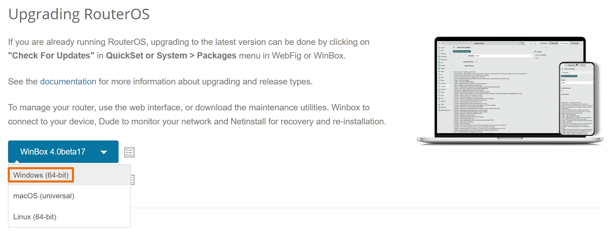

### RouterOS 镜像:


### 镜像校验信息：

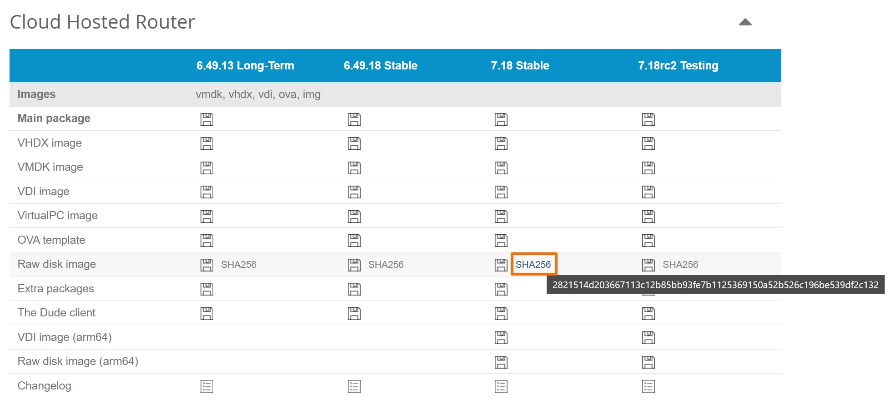

## 1.创建 RouterOS 虚拟机

### 1.1.常规

登录到 PVE 后台后，进入新建虚拟机流程，并打开底部 `高级` 选项。  

`节点` 选择当前设备，`VM ID` 和 `名称` 可自定义。  

`启动/关机顺序` 和 `启动延时` 可按需调整。  


### 1.2.操作系统

操作系统 `类别` 选择 `Linux` 、内核 `版本` 选择 `6.x - 2.6 Kernel` 即可，且无需使用引导介质。  

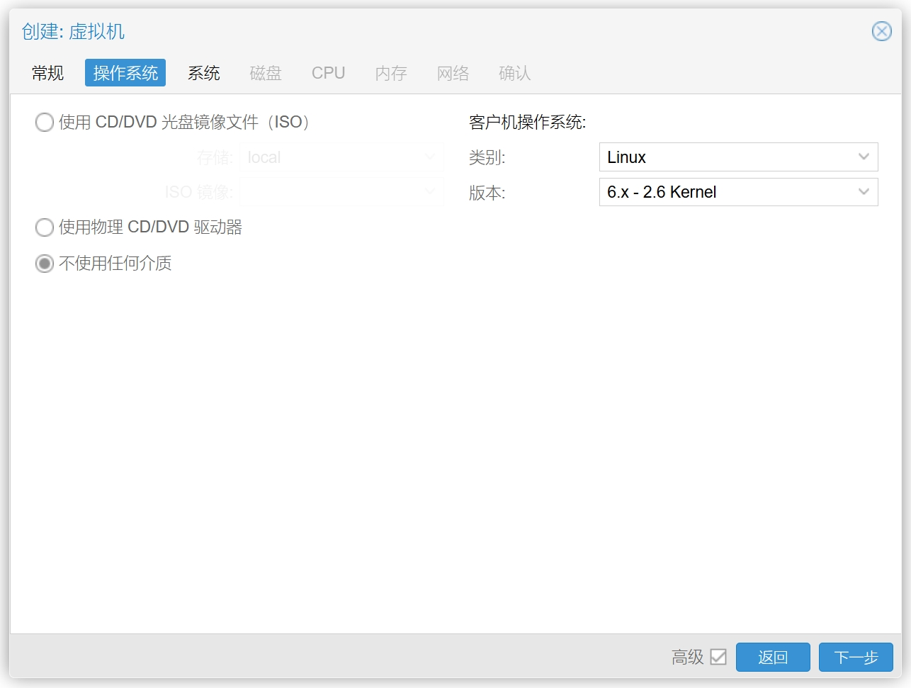

### 1.3.系统

`显卡` 选择 `默认` ，`机型` 选择 `q35` ，对 `PCIE` 直通设备有更好的支持。  

新版的 RouterOS 对 `Qemu Agent` 支持良好，因此建议勾选 `Qemu代理` 选项。    

如果后续使用过程中 RouterOS **不稳定** ，请保持 `机型` 选择 `默认(i440fx)` 。

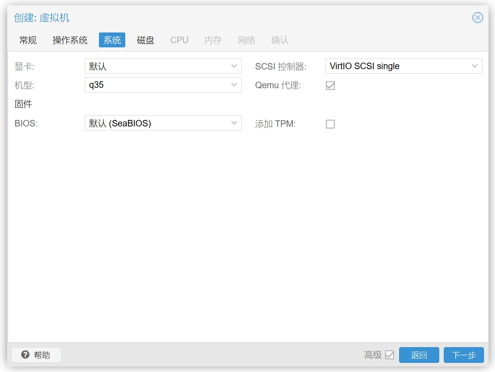

### 1.4.磁盘

后续将导入 RouterOS 镜像文件并生成磁盘，因此移除所有自动添加的磁盘。  

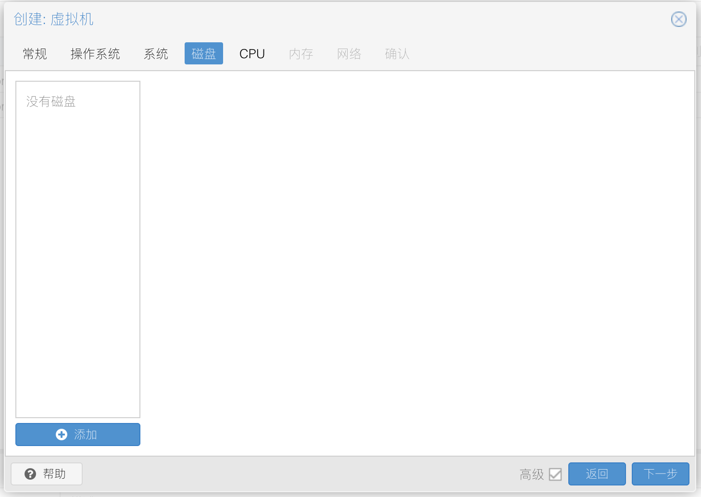

### 1.5.CPU

请根据物理设备 CPU 资源使用情况来分配 RouterOS CPU 资源。  

CPU `类别` 选择 `host` ，`核心` 根据物理 CPU 核心数进行酌情设置。  

如果设备有多路 CPU 推荐启用 **NUMA** 。  

如果设备 CPU **超分（Over-Commit）** 比较严重，可适当将 `CPU权重` 参数翻倍，让 RouterOS 获得更多的 CPU 时间。  
 
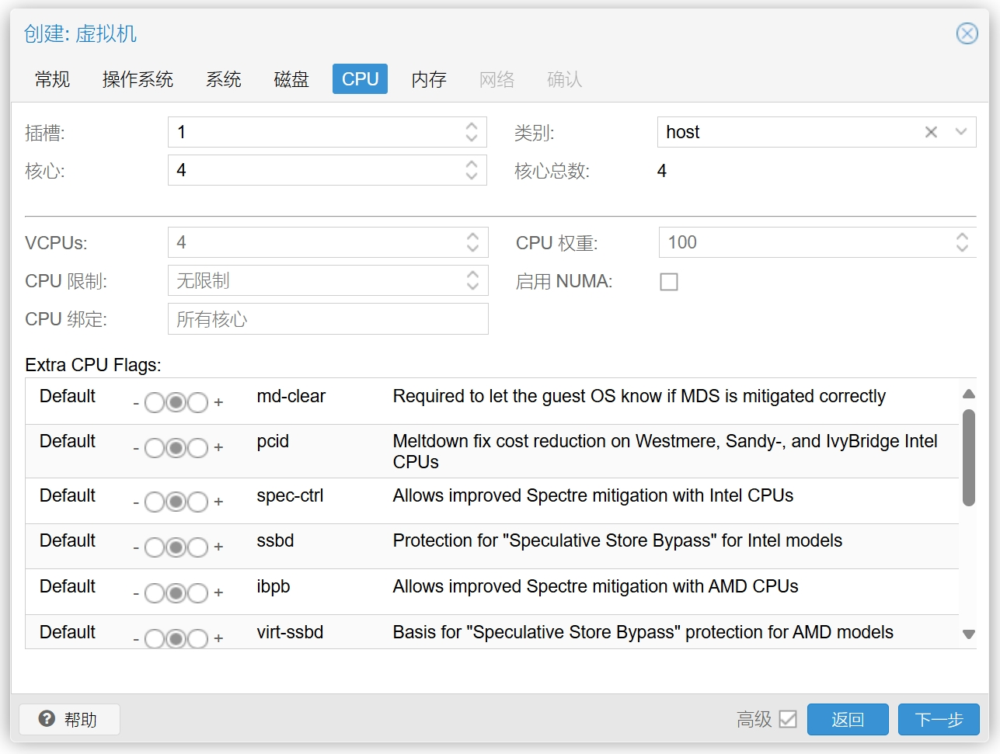

### 1.6.内存

内存一般 `2048MiB` （ `2GB` ）足够使用，关闭 `Ballooning设备` 选项。  

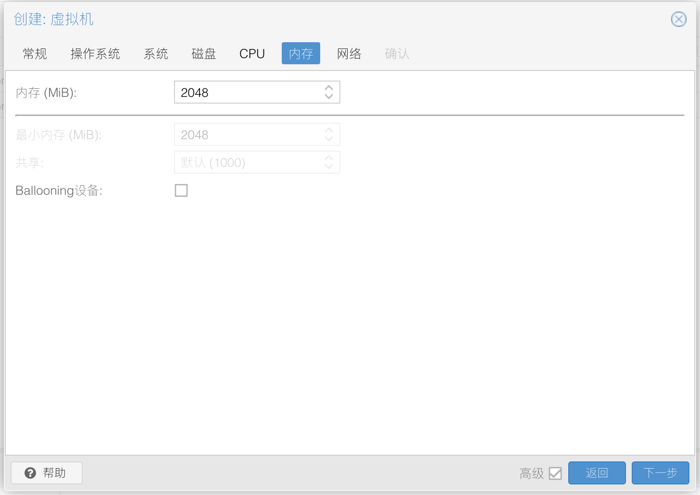

### 1.7.网络

需要注意，当前页面只能设置单个网络设备，而网络设备的添加顺序将和 RouterOS 内部显示的网卡顺序一致。  

因此，先仅添加 `WAN` 对应的网口（ 此处为 `vmbr0` ），`模型` 选择 `VirtIO` ，并取消勾选 `防火墙` 选项。  

对于使用硬件直通的小伙伴，可根据实际情况来修改此处网络设备选项。  

推荐在 **Multiqueue** 处根据前面设置的 CPU 数量进行网卡多队列设置，设置比例为 1:1 。  

即有 n 个 CPU 核心，此处多队列也设置为 n 。  

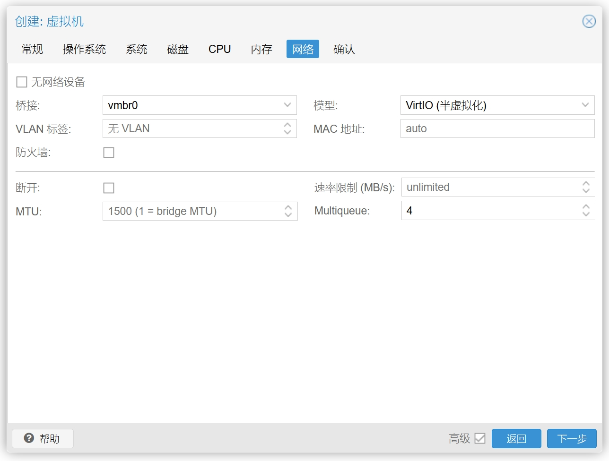

根据官方文档中对 `Multiqueue` 的描述：  

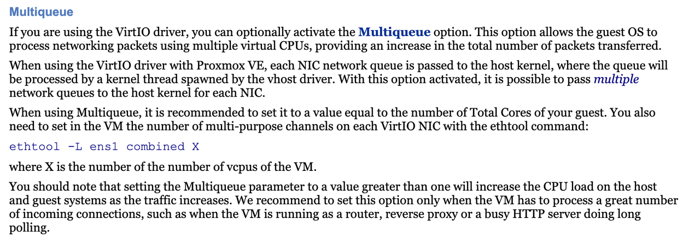

因此，对于使用 `VirtIO` 网卡的虚拟机，特别是作为路由器使用且需处理大量带宽时，可以在一定程度上提高其网络吞吐性能。  

但 RouterOS v6 版本对 `Multiqueue` 可能未良好支持，因此建议 RouterOS v7 及以上版本开启该选项。  

### 1.8.确认

接下来查看设置总览，确认无误后，即可点击 `完成` 。  


## 2.调整虚拟机硬件参数

此时，查看虚拟机详情页，可以看到刚创建好的虚拟机。  

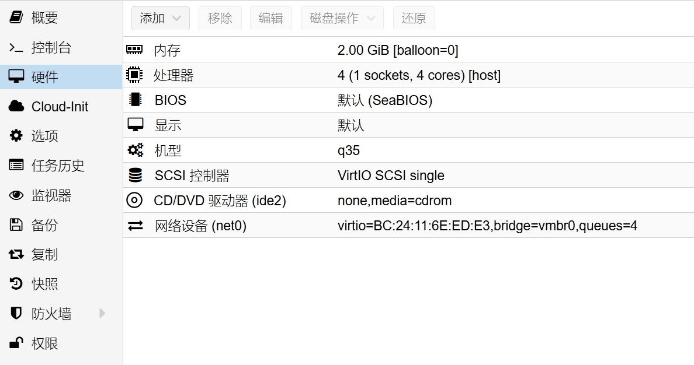

去掉 CD/DVD 驱动器后，开始添加网络设备。  

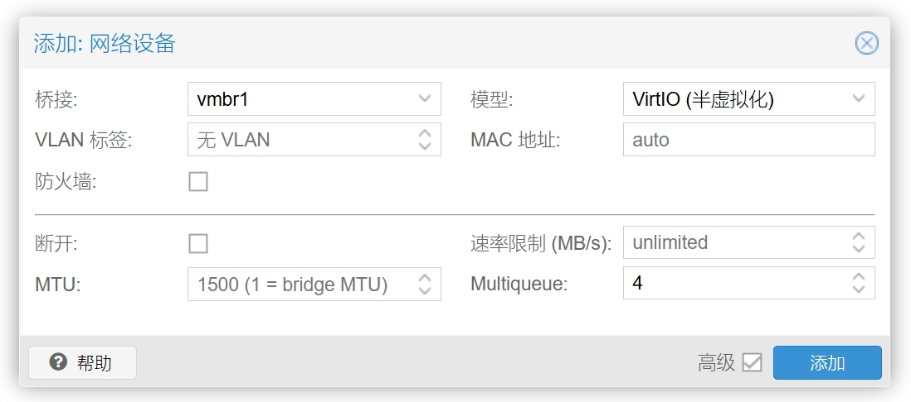

重复添加网络设备，去掉防火墙，并增加网卡多队列参数后，示例如下：  

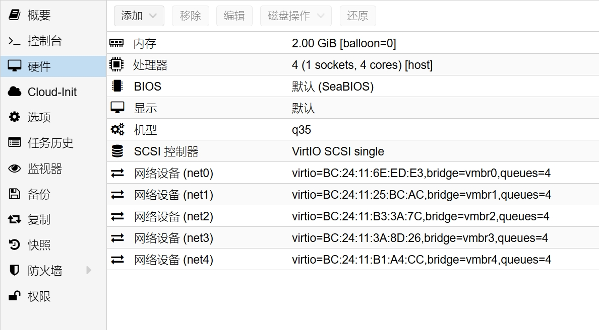

## 3.创建 RouterOS 系统盘

### 3.1.上传镜像文件

使用终端工具登录到 PVE 服务器，在 `/tmp` 目录中创建一个目录用于下载 RouterOS 镜像文件。  

```bash
## 创建目录
$ mkdir -p /tmp/RouterOS

## 进入目录
$ cd /tmp/RouterOS

## 下载 RouterOS 镜像文件
$ curl -LR -O https://download.mikrotik.com/routeros/7.18/chr-7.18.img.zip
```

镜像文件下载完成后，检查其 `hash` 信息。  

```bash
## 检查文件是否存在
$ ls -lah

## 计算文件 hash
$ sha256sum chr-7.18.img.zip

#### 文件 hash 示例输出
2821514d203667113c12b85bb93fe7b1125369150a52b526c196be539df2c132  chr-7.18.img.zip
```

将得到的 `hash` 值与官网提供的校验信息进行对比，确认无误后，再进行后续步骤。  

由于镜像文件为 `zip` 压缩格式，无法直接使用，因此需要对其解压缩。  

执行以下命令，解压出 `img` 格式镜像。  

```bash
## 将镜像文件解压缩
$ unzip -q chr-7.18.img.zip
```

### 3.2.导入镜像文件

在创建 RouterOS 虚拟机时，曾指定了 `VM ID`，演示中为 **`101`** 。  

使用该 `VM ID` 将 RouterOS 镜像导入 PVE 系统。  

```bash
## 将 img 镜像导入虚拟机中
$ qm importdisk 101 chr-7.18.img local-lvm

#### img 镜像导入示例输出
unused0: successfully imported disk 'local-lvm:vm-101-disk-0'
```

### 3.3.调整虚拟机磁盘设置

磁盘导入成功后，虚拟机硬件列表中将显示一块未使用的磁盘设备，可鼠标 **双击** 该设备进行配置调整。  

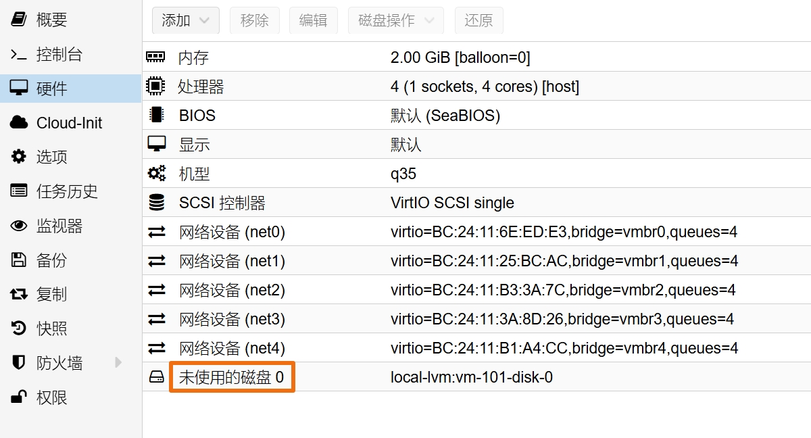

当宿主机使用 `SSD` 作为物理存储设备，并且虚拟磁盘采用 `精简置备` （Thin Provisioning） 模式时，可考虑开启以下选项：  

- `丢弃` （Discard） 选项，有助于存储空间回收。  

- `SSD仿真` （SSD Emulation） 选项，让虚拟机将虚拟磁盘视为 `SSD` 存储设备。  

在弹出的对话框中，确认 `IO thread` 选项为 **勾选** 状态，并点击 `添加` 。  

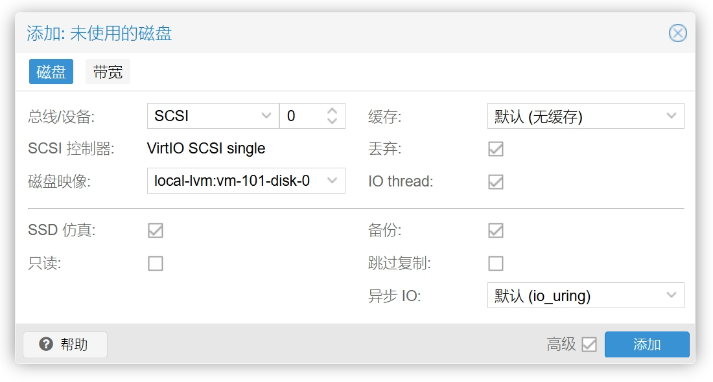

此时，磁盘大小为 `128` MiB ，为了方便后续使用，需要对该磁盘空间进行扩容。  

此处扩容后，在 RouterOS 虚拟机 **初次启动** 时，会根据磁盘空间自动扩容安装，所以无需担心。  

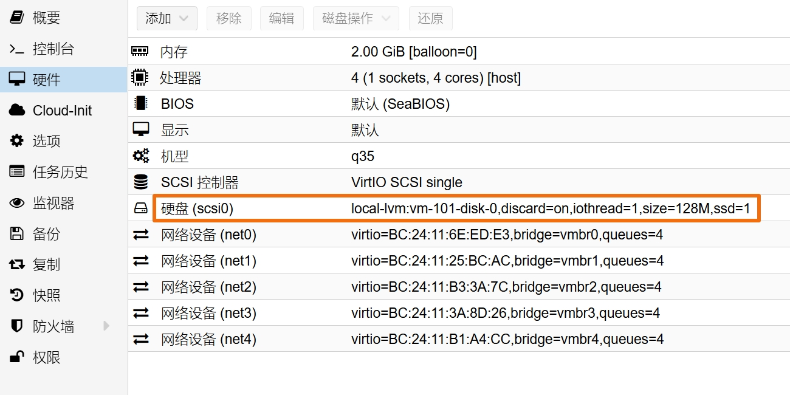

选中该磁盘，然后点击 `磁盘操作` 的 `调整大小` ：

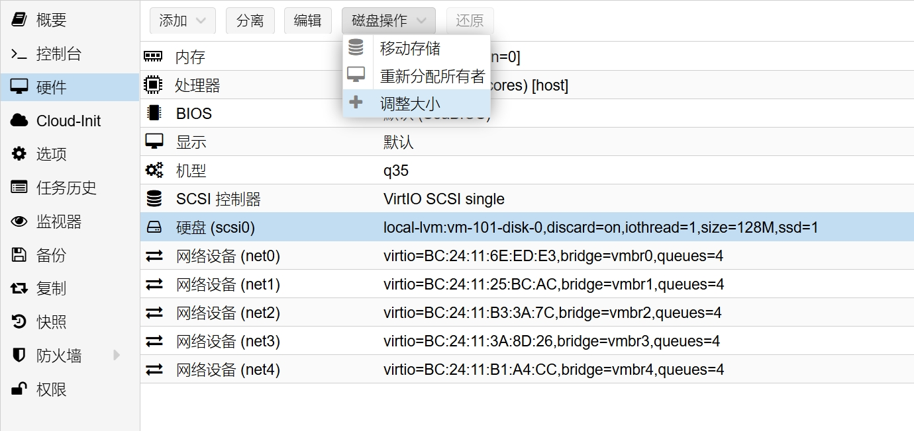

根据需要，扩容一定量的磁盘空间；本文作为演示，仅增加 `1.875` GiB 的磁盘空间，并点击 `调整磁盘大小` ：  


调整完成后，磁盘容量已被扩容。  

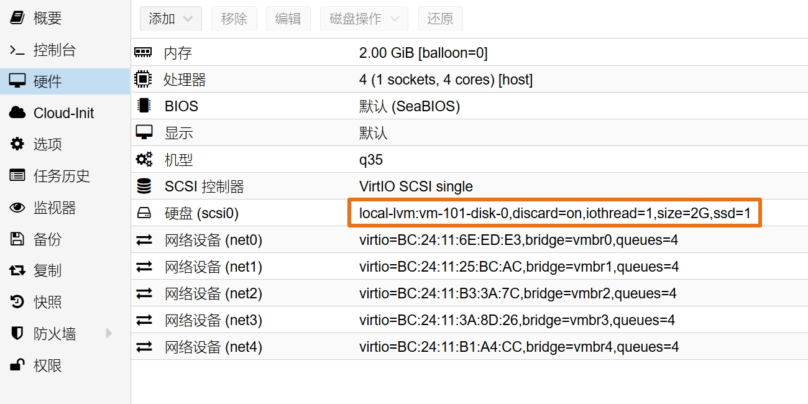

## 4.创建 RouterOS 日志盘

RouterOS 的日志一般记录在内存中，当系统重启后，历史日志将会丢失。  

而使用附加硬盘来记录 RouterOS 的日志，可在系统意外重启时看到历史日志，方便追溯问题。  

点击顶部 `添加` ，选择 `硬盘` ：  

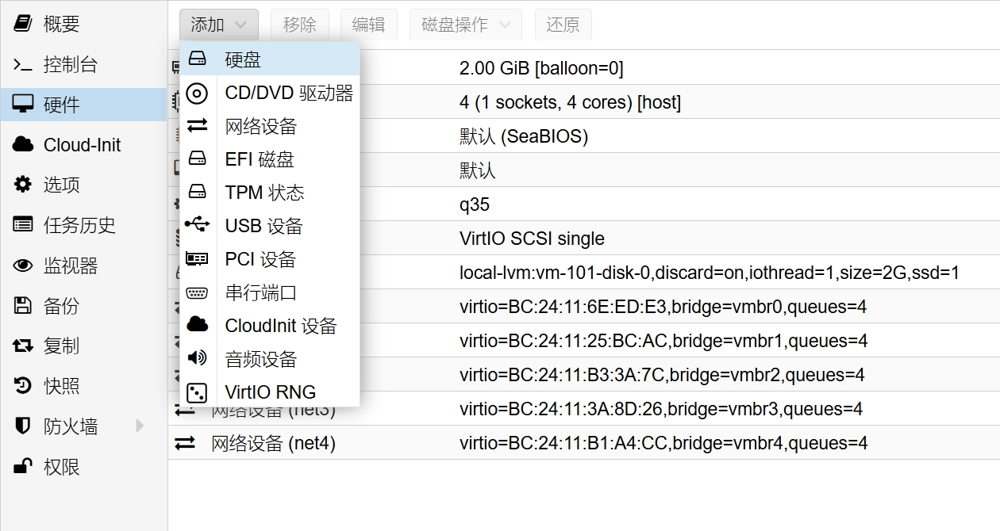

`总线/设备` 选择 `SCSI` ，设备编号 PVE 会自动设置，演示中为 `1` 。  

`磁盘大小` 根据 PVE 服务器资源剩余情况酌情设置，演示为 `1` GiB 。  

打开底部 `高级` 选项，并确认 `IO thread` 选项为 **勾选** 状态：  

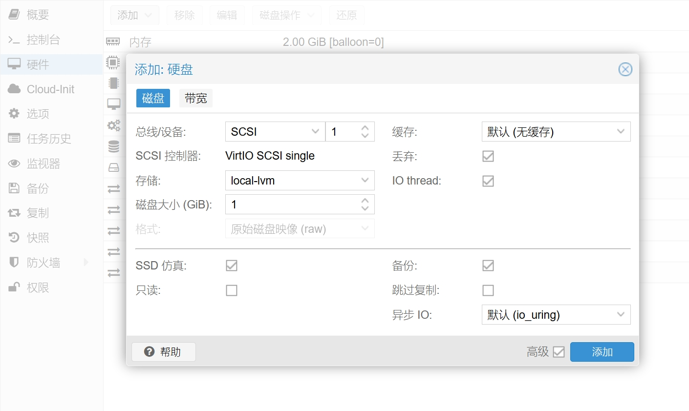

日志盘添加完成后，如图所示：  

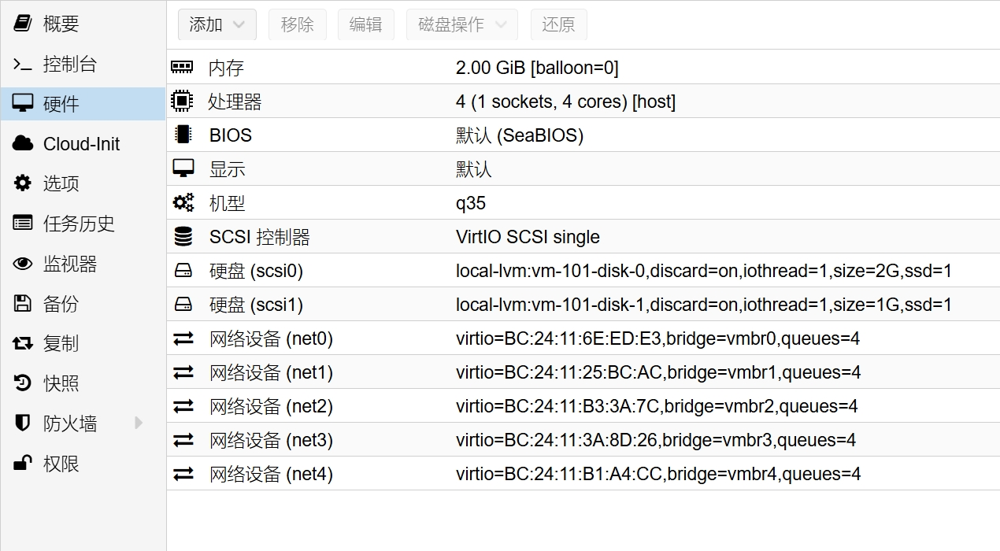

## 5.调整虚拟机配置参数

初创的 RouterOS 的配置参数如下，需要修改的部分有如下几个：  

- 开机自启动（建议在 RouterOS 完全设置好之后再修改）  

- 启动/关机顺序（建议在 RouterOS 完全设置好之后再修改）  

- 引导顺序  

- 使用平板指针  

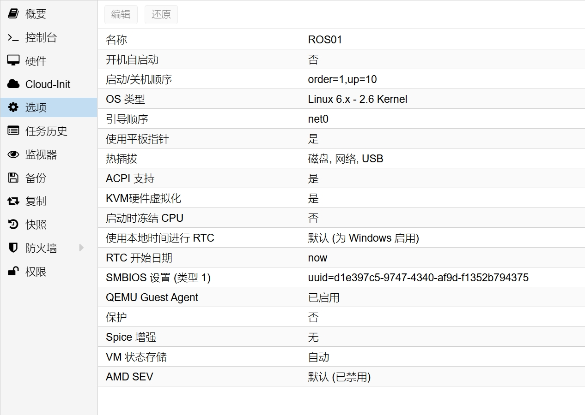

### 5.1.设置开机自启动

开机自启动设置为 “是” ，启动顺序推荐如下：  

- `启动/关机顺序` 为 `1` ，表示该虚拟机第一个启动，最后一个关机。  

- `启动延时` 为 `10` ，表示该虚拟机启动后，延迟 `10` 秒再启动下一个虚拟机。  

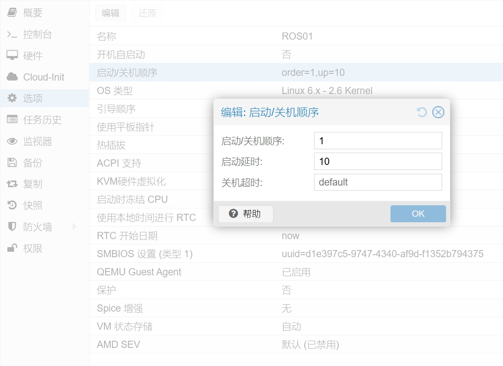

### 5.2.修改引导顺序

在 `net0` 设备处，**取消勾选** “已启用” 复选框。  

在 `scsi0` 设备处，**勾选** “已启用” 复选框，并使用行首的排序功能，将该设备拖拽到第一个。  

然后点击 `OK` 。  

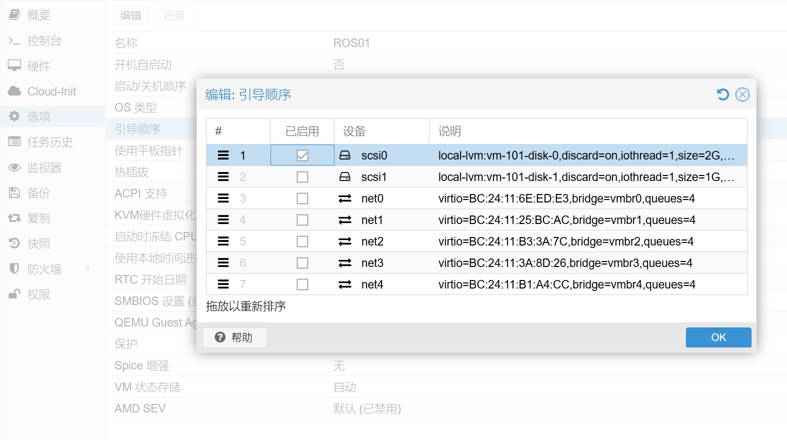

### 5.3.修改平板指针设置

关闭 `使用平板指针` 选项，可以一定程度上降低虚拟机的 CPU 使用率。  

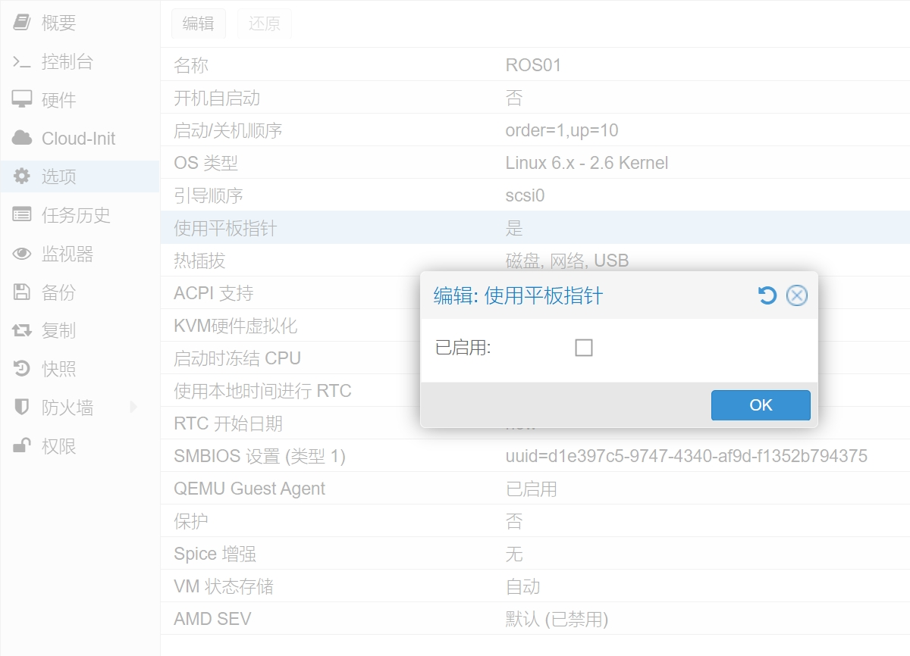

修改完成后，总体情况如下，等待 RouterOS 完全配置好，运行无异常之后，即可开启该虚拟机的 `开机自启动` 选项。  

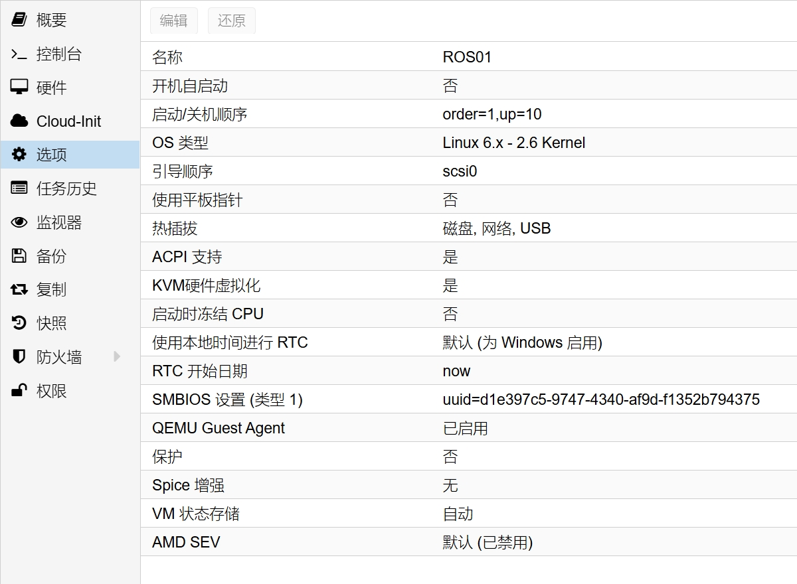

### 5.4.设置虚拟机备注信息

进入左侧虚拟机 `概要` 页面，修改虚拟机的备注信息。  

```bash
### 服务器信息

- 系统： RouterOS

- 用途： 主路由系统

- 自启： 是

- 用户： admin ( 只读 )

- 用户： fox ( 管理 )

- IPv4： 10.7.1.1/24

- IPv6： DHCPv6 Client

```


## 6.虚拟机开机

此时开始检验 RouterOS 虚拟机是否可以正常启动。  

切换到虚拟机的 `控制台` 选项卡，让虚拟机开机。  

此处需要注意的是，目前 RouterOS 并未设置，因此不会对网络造成什么影响，但是如果后续 RouterOS 配置了内部网络接口的桥接，且此时 PVE 有其他的路由系统（例如 Openwrt ）也在相同的网络接口上有桥接，就会引起网络环路导致网络无法访问。  

开机后，显示如图内容，即表示 RouterOS 已经安装成功。  

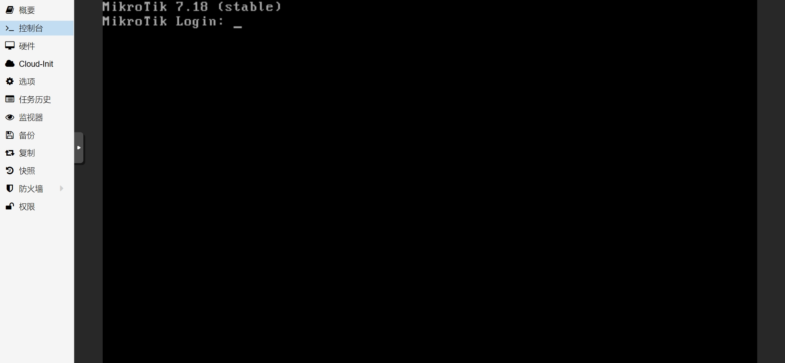

RouterOS 的默认账户为 `admin` ，无需密码即可登录。  

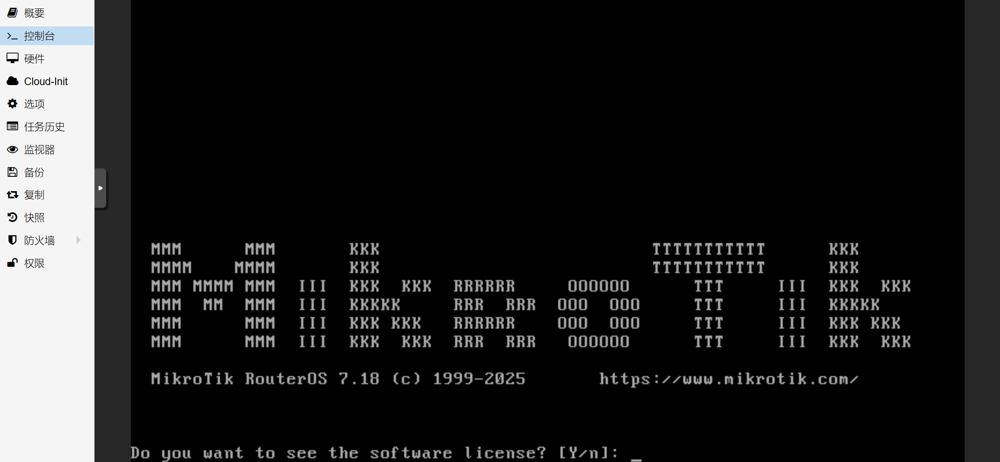

至此，RouterOS 虚拟机安装步骤完成。  

